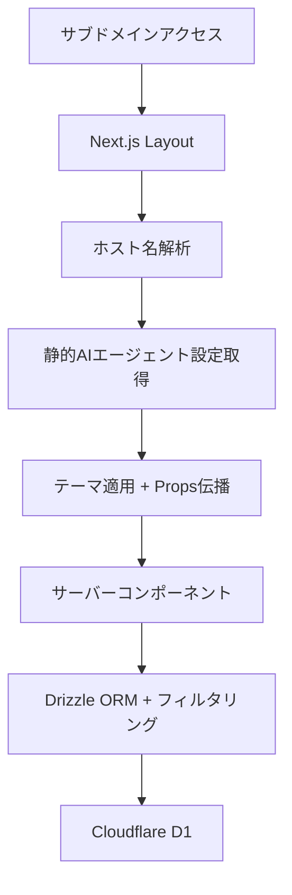
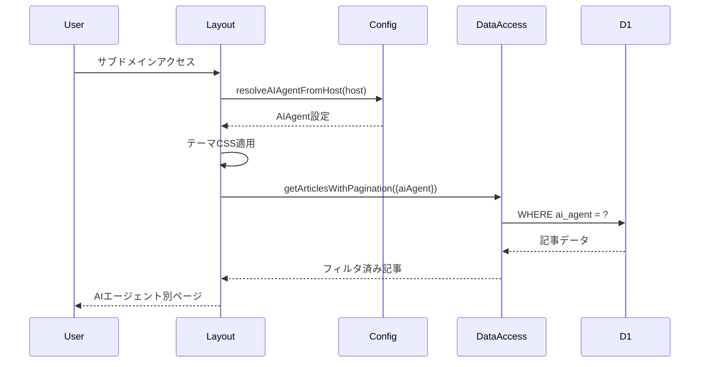

# 設計文書: 簡素化マルチテナント・サブドメインルーティングシステム

## 概要

本機能は、CC-VaultをAIエージェント情報キュレーションメディアに転換し、各AIエージェントが専用サブドメインで独自のコンテンツとデザインを提供するシステムを実現します。Next.js App Routerとサーバーコンポーネントを活用し、最小限の変更で最大の効果を実現する簡素化アプローチを採用します。

### Goals
- サブドメイン別のAIエージェント専用コンテンツ配信
- 既存のCC-Vaultアーキテクチャとの完全互換性
- サーバーコンポーネント中心の実装によるパフォーマンス最適化
- 最小限のデータベース変更での実現

### Non-Goals
- 複雑なマルチテナント管理システム
- 動的なテナント追加機能（静的設定で管理）
- 複雑なテーマカスタマイゼーション（色とコンテンツのみ変更）
- リアルタイムテナント切り替え機能

## アーキテクチャ

### 既存アーキテクチャ分析

**現在のCC-Vault構成**:
- Next.js App Router + Cloudflare Workers
- Drizzle ORMによるD1データベースアクセス
- サーバーコンポーネント中心の実装
- 静的設定とISRキャッシュの活用

**保持する設計パターン**:
- ページレベルでのサーバーサイドデータ取得
- 既存のコンポーネント構造とスタイリング手法
- Drizzle ORMベースのデータアクセス層
- Tailwind CSSによるスタイリング

### 簡素化アーキテクチャ



**重要な簡素化ポイント**:
- ミドルウェア不要（layout.tsxで直接処理）
- APIエンドポイント不要（サーバーコンポーネントで直接データ取得）
- 複雑なContext Provider不要（Props経由でデータ伝播）
- 動的CSS Variables不要（静的CSSクラス + Tailwind Variables）

### 技術スタック整合

**既存技術スタックとの整合**:
- Next.js 15.5.0 App Router（変更なし）
- Cloudflare Workers + D1（変更なし）
- Drizzle ORM（変更なし）
- Tailwind CSS（変更なし）

**新規追加要素**:
- 静的AIエージェント設定ファイル
- 最小限のデータベースカラム追加

## コンポーネントとインターフェース

### Core / AIエージェント管理

#### AIエージェント設定管理

**主要責任**: 静的設定からAIエージェント情報を提供し、ホスト名に基づくテナント解決を行う

**依存関係**:
- **Inbound**: layout.tsx、page.tsx
- **Outbound**: なし（静的設定）
- **External**: Next.js headers() API

**契約定義**:

```typescript
// src/config/ai-agents.ts
type AIAgent = {
  id: 'default' | 'claude-code' | 'codex';
  name: string;
  description: string;
  colors: {
    primary: string;
    secondary: string;
    accent: string;
  };
  contentFilter: string[];
  branding: {
    siteName: string;
    tagline?: string;
  };
};

function resolveAIAgentFromHost(host: string | null): AIAgent;
function getAIAgentConfig(agentId: string): AIAgent;
```

#### データアクセス拡張

**主要責任**: 既存のCloudflare D1アクセス関数にAIエージェントフィルタリングを追加

**依存関係**:
- **Inbound**: page.tsx、各種サーバーコンポーネント
- **Outbound**: Drizzle ORM、Cloudflare D1
- **External**: なし

**契約定義**:

```typescript
// src/lib/cloudflare.ts への拡張
type ArticleFilters = {
  aiAgent?: string;
  page?: number;
  limit?: number;
  site?: string;
};

function getArticlesWithPagination(filters: ArticleFilters): Promise<Article[]>;
function getWeeklyReportData(aiAgent: string, weekStart: string): Promise<WeeklyReport | null>;
function getTotalArticleCount(aiAgent?: string): Promise<number>;
```

**既存関数への最小限拡張**:
- `getArticlesWithPagination`にaiAgentフィルターを追加
- `getWeeklyReportData`にAIエージェント別集計を追加
- 新規関数追加は最小限（2-3個のみ）

### Layout / レイアウトコンポーネント

#### AIエージェント対応レイアウト

**主要責任**: ホスト名からAIエージェントを特定し、テーマとコンテンツをサーバーサイドで適用

**依存関係**:
- **Inbound**: Next.js App Router
- **Outbound**: AIエージェント設定、既存Header/Footerコンポーネント
- **External**: Next.js headers() API

**契約定義**:

```typescript
// src/app/layout.tsx への変更
type LayoutProps = {
  children: React.ReactNode;
};

// サーバーコンポーネントとして実装
export default async function RootLayout({ children }: LayoutProps): Promise<JSX.Element>;
```

**実装戦略**:
- `headers()`でホスト名取得
- 静的設定からAIエージェント特定
- `data-ai-agent`属性でCSSスコープ適用
- 既存コンポーネントにpropsでAIエージェント情報伝播

## データ モデル

### 既存テーブル拡張

**最小限の変更方針**: 既存のarticlesテーブルに`ai_agent`カラムのみ追加

```sql
-- 既存articlesテーブルへの単一カラム追加
ALTER TABLE articles ADD COLUMN ai_agent TEXT DEFAULT 'all';
```

**カラム定義**:
- `ai_agent`: 'all' | 'claude-code' | 'codex' （記事の対象AIエージェント）

**インデックス追加**:
```sql
CREATE INDEX idx_articles_ai_agent ON articles(ai_agent);
```

**データベース設計の利点**:
- 既存データとの完全互換性（DEFAULT 'all'）
- 単一カラム追加による最小限の変更
- 既存のソート・フィルタリング機能をそのまま活用

## システムフロー

### メイン処理フロー



## 実装戦略

### サーバーコンポーネント中心設計

**ミドルウェア不要**: layout.tsxで直接ホスト名処理

**実装する最小限のコンポーネント**:

1. **静的設定ファイル** (`src/config/ai-agents.ts`)
   - AIエージェント設定の静的定義
   - ホスト名からAIエージェント解決関数

2. **レイアウト拡張** (`src/app/layout.tsx`)
   - `headers()`でホスト名取得
   - AIエージェント設定適用
   - data-ai-agent属性での CSS スコープ

3. **データアクセス拡張** (`src/lib/cloudflare.ts`)
   - 既存関数に`aiAgent`パラメータ追加
   - WHERE句での`ai_agent`フィルタリング

4. **CSS拡張** (`src/app/globals.css`)
   - `[data-ai-agent="claude-code"]`等のセレクタ
   - AIエージェント別の色定義

## エラーハンドリング

### エラー戦略

**不明なAIエージェント**: デフォルト設定へのフォールバック
**データベースエラー**: 既存のエラーハンドリング機構を活用
**設定エラー**: 開発時の適切なエラーメッセージ

### エラーカテゴリと対応

**ホスト名解析エラー**: 'default' AIエージェントにフォールバック
**データフィルタリングエラー**: 既存のCloudflareエラーハンドリング活用
**CSS適用エラー**: デフォルトスタイルで graceful degradation

## テスト戦略

### 統合テスト

- ホスト名からAIエージェント解決のテスト
- データベースフィルタリング機能のテスト
- CSSスコープ適用のテスト

### E2Eテスト

- サブドメインアクセスでの正しいコンテンツ表示
- AIエージェント別の記事フィルタリング
- テーマ適用の視覚的確認

## 実装計画

### Phase 1: 基盤構築（最小限）
1. `ai_agent`カラム追加とインデックス作成
2. 静的AIエージェント設定ファイル作成
3. layout.tsxでのホスト名解析実装

### Phase 2: データアクセス拡張
1. 既存関数への`aiAgent`パラメータ追加
2. WHERE句でのフィルタリング実装
3. 基本的な動作確認

### Phase 3: UIテーマ適用
1. CSS data-attribute スコープ実装
2. AIエージェント別の色定義
3. 既存コンポーネントとの統合

### Phase 4: 最終調整
1. エラーハンドリングの実装
2. テストケースの追加
3. パフォーマンス確認