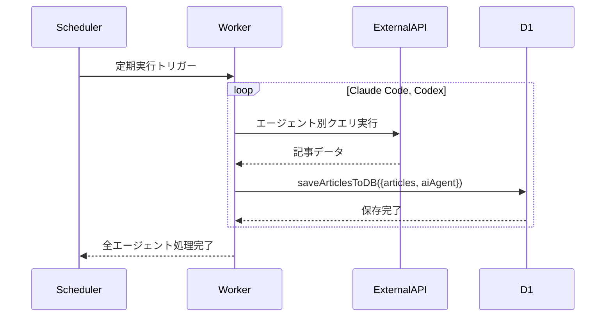

# 設計文書: 簡素化マルチテナント・サブドメインルーティングシステム

## 概要

本機能は、CC-VaultをAIエージェント情報キュレーションメディアに転換し、各AIエージェントが専用サブドメインで独自のコンテンツとデザインを提供するシステムを実現します。既存のNext.js App Routerアーキテクチャを最大限活用し、最小限の変更で最大の効果を実現する簡素化アプローチを採用します。

## Codexエージェント追加の影響範囲

### A. 設定・定義層の変更
1. **AIエージェント型定義拡張** (`src/config/ai-agents.ts`)
   - `id`型を`'claude-code' | 'codex'`に拡張
   - `searchQueries`プロパティ追加（zenn/qiita/hatena）
   - Codexエージェント設定オブジェクト追加

### B. データ収集層の変更
2. **custom-worker.ts記事収集ロジック修正**
   - ハードコード`ai_agent: 'claude-code'`除去
   - Claude Code/Codexエージェントループ実装
   - エージェント別検索クエリ実行（`claudecode`/`codex`）

### C. データアクセス層の変更
3. **データベーススキーマ拡張**
   - `ai_agent`カラム値に`'codex'`追加
   - 既存`'claude-code'`データとの併存

### D. フロントエンド層の変更
4. **サブドメインルーティング対応**
   - `codex.cc-vault.com`サブドメイン解決
   - Codex専用テーマ・色設定
   - Codexブランディング要素

### E. 変更されない範囲
- 既存の記事表示ロジック（フィルタリングのみ適用）
- データベースクエリ処理（WHERE句にエージェント条件追加のみ）
- レイアウト・コンポーネント構造
- Next.js App Router設定

### 目標
- サブドメイン別のAIエージェント専用コンテンツ配信
- 既存のCC-Vaultアーキテクチャとの完全互換性
- サーバーコンポーネント中心の実装によるパフォーマンス最適化
- 最小限のデータベース変更での実現

### 非目標
- 複雑なマルチテナント管理システム
- 動的なテナント追加機能（静的設定で管理）
- 複雑なテーマカスタマイゼーション（色とコンテンツのみ変更）
- クライアントサイドでのテナント切り替え機能

## アーキテクチャ

### 既存アーキテクチャ分析

**現在のCC-Vault構成**:
- Next.js App Router + Cloudflare Workers
- Drizzle ORMによるD1データベースアクセス
- サーバーコンポーネント中心の実装
- 既存のsite-basedフィルタリング機能

**保持する設計パターン**:
- ページレベルでのサーバーサイドデータ取得
- 既存のコンポーネント構造とスタイリング手法
- Drizzle ORMベースのデータアクセス層
- 関数ベース実装（クラス使用禁止）

### 簡素化アーキテクチャ


### 技術スタック整合

**既存技術スタックとの整合**:
- Next.js 15.5.0 App Router（変更なし）
- Cloudflare Workers + D1（変更なし）
- Drizzle ORM（変更なし）
- Tailwind CSS（変更なし）

**新規追加要素**:
- 静的AIエージェント設定ファイル
- articlesテーブルに`ai_agent`カラム追加のみ

## 要件トレーサビリティ

| 要件 | 要件概要 | 実現コンポーネント | 実装方法 |
|------|----------|------------------|----------|
| 1.1 | ホスト名からテナント識別子抽出 | layout.tsx | headers()でホスト名取得 |
| 1.2 | AIエージェント設定特定 | 静的設定ファイル | resolveAIAgentFromHost関数 |
| 2.1 | テナント別データフィルタリング | cloudflare.ts拡張 | ai_agentカラムでWHERE句適用 |
| 3.1 | 動的UIテーマ適用 | layout.tsx | data-ai-agent属性 + CSS |
| 4.1 | テナント別コンテンツ表示 | 既存ページコンポーネント | フィルタ済みprops渡し |
| 5.1 | テナント設定管理 | 静的設定ファイル | TypeScript設定定義 |
| 6.1 | パフォーマンス維持 | Next.js ISR | サーバーコンポーネントキャッシュ |
| 7.1 | セキュリティ維持 | 既存パターン活用 | 入力検証とフォールバック |

## コンポーネントとインターフェース

### Core / AIエージェント管理

#### AIエージェント設定管理

**主要責任**: 静的設定からAIエージェント情報を提供し、ホスト名に基づくテナント解決を行う

**依存関係**:
- **Inbound**: layout.tsx、page.tsx、custom-worker.ts
- **Outbound**: なし（静的設定）
- **External**: Next.js headers() API

**契約定義**:

```typescript
// src/config/ai-agents.ts
type AIAgent = {
  id: 'claude-code' | 'codex';
  name: string;
  description: string;
  colors: {
    primary: string;
    secondary: string;
    accent: string;
  };
  contentFilter: string[];
  searchQueries: {
    zenn: string;
    qiita: string;
    hatena: string;
  };
  branding: {
    siteName: string;
  };
};

function resolveAIAgentFromHost(args: { host: string | null }): AIAgent;
function getAIAgentConfig(args: { agentId: string }): AIAgent;
```

#### データアクセス拡張

**主要責任**: 既存のCloudflare D1アクセス関数にAIエージェントフィルタリングを追加

**依存関係**:
- **Inbound**: page.tsx、各種サーバーコンポーネント、custom-worker.ts
- **Outbound**: Drizzle ORM、Cloudflare D1
- **External**: なし

**契約定義**:

```typescript
// src/lib/cloudflare.ts への拡張
type ArticleFilters = {
  aiAgent?: string;
  page?: number;
  limit?: number;
  site?: string;
};

function getArticlesWithPagination(args: {
  db: D1Database;
  params: ArticleFilters;
}): Promise<PaginatedArticles>;
```

**既存関数への最小限拡張**:
- `getArticlesWithPagination`にaiAgentフィルターを追加
- WHERE句でのai_agentカラムフィルタリング
- 新規関数追加は最小限

### Worker / データ収集管理

#### custom-worker.ts拡張

**主要責任**: 既存の記事収集処理をエージェント別に実行

**修正内容**:
- Claude Code: `claudecode`で検索 → `ai_agent: 'claude-code'`で保存
- Codex: `codex`で検索 → `ai_agent: 'codex'`で保存
- ハードコード`ai_agent: 'claude-code'`をエージェントループに変更

### Layout / レイアウトコンポーネント

#### AIエージェント対応レイアウト

**主要責任**: ホスト名からAIエージェントを特定し、テーマとコンテンツをサーバーサイドで適用

**依存関係**:
- **Inbound**: Next.js App Router
- **Outbound**: AIエージェント設定、既存Header/Footerコンポーネント
- **External**: Next.js headers() API

**契約定義**:

```typescript
// src/app/layout.tsx への変更
type LayoutProps = {
  children: React.ReactNode;
};

// サーバーコンポーネントとして実装
export default async function RootLayout(args: LayoutProps): Promise<JSX.Element>;
```

**実装戦略**:
- `headers()`でホスト名取得
- 静的設定からAIエージェント特定
- `data-ai-agent`属性でCSSスコープ適用
- 既存コンポーネントにpropsでAIエージェント情報伝播

## データモデル

### 既存テーブル拡張

**最小限の変更方針**: 既存のarticlesテーブルに`ai_agent`カラムのみ追加

```sql
-- 既存articlesテーブルへの単一カラム追加
ALTER TABLE articles ADD COLUMN ai_agent TEXT DEFAULT 'all';
```

**カラム定義**:
- `ai_agent`: 'all' | 'claude-code' | 'codex' （記事の対象AIエージェント）

**インデックス追加**:
```sql
CREATE INDEX idx_articles_ai_agent ON articles(ai_agent);
```

**データベース設計の利点**:
- 既存データとの完全互換性（DEFAULT 'all'）
- 単一カラム追加による最小限の変更
- 既存のソート・フィルタリング機能をそのまま活用

## システムフロー

### メイン処理フロー


### エージェント別データ収集フロー



## エラーハンドリング

### エラー戦略

シンプルで堅牢なエラーハンドリング戦略を採用します。

### エラーカテゴリと対応

**未知のサブドメイン**: デフォルトAIエージェント（'default'）への透過的フォールバック
**データベースエラー**: 既存のCloudflareエラーハンドリング活用
**CSS適用エラー**: デフォルトスタイルでのgraceful degradation

```typescript
function resolveAIAgentFromHost(args: { host: string | null }): AIAgent {
  const subdomain = extractSubdomain(args.host);
  return getAIAgentConfig({ agentId: subdomain }) ?? DEFAULT_AI_AGENT;
}
```

## テスト戦略

### ユニットテスト
- AIエージェント設定解決関数
- データフィルタリング関数
- ホスト名パース機能

### 統合テスト
- ホスト名からAIエージェント解決の統合フロー
- データベースフィルタリング機能
- CSSスコープ適用

### E2Eテスト
- サブドメインアクセスでの正しいコンテンツ表示
- AIエージェント別の記事フィルタリング
- テーマ適用の視覚的確認

## 実装戦略

### サーバーコンポーネント中心設計

**実装する最小限のコンポーネント**:

1. **静的設定ファイル** (`src/config/ai-agents.ts`)
   - AIエージェント設定の静的定義
   - ホスト名からAIエージェント解決関数

2. **レイアウト拡張** (`src/app/layout.tsx`)
   - `headers()`でホスト名取得
   - AIエージェント設定適用
   - data-ai-agent属性での CSS スコープ

3. **データアクセス拡張** (`src/lib/cloudflare.ts`)
   - 既存関数に`aiAgent`パラメータ追加
   - WHERE句での`ai_agent`フィルタリング

4. **CSS拡張** (`src/app/globals.css`)
   - `[data-ai-agent="claude-code"]`等のセレクタ
   - AIエージェント別の色定義

### 実装フェーズ

#### Phase 1: 基盤構築（最小限）
1. `ai_agent`カラム追加とインデックス作成
2. 静的AIエージェント設定ファイル作成
3. layout.tsxでのホスト名解析実装

#### Phase 2: データアクセス拡張
1. 既存関数への`aiAgent`パラメータ追加
2. WHERE句でのフィルタリング実装
3. 基本的な動作確認

#### Phase 3: Worker層エージェント別データ収集
1. `src/config/ai-agents.ts`にCodex設定追加（`searchQueries`含む）
2. `custom-worker.ts`の既存ハードコード`ai_agent: 'claude-code'`除去
3. エージェント設定ループによる動的記事収集実装
4. Claude Code（`claudecode`）とCodex（`codex`）の並列収集実行

#### Phase 4: UIテーマ適用
1. CSS data-attribute スコープ実装
2. AIエージェント別の色定義
3. 既存コンポーネントとの統合

#### Phase 5: 最終調整
1. エラーハンドリングの実装
2. テストケースの追加
3. パフォーマンス確認

## パフォーマンス・スケーラビリティ

### キャッシュ戦略

**Next.js ISR活用**: サーバーコンポーネントでの自動キャッシュ
**静的設定**: AIエージェント設定の起動時読み込み
**データベースキャッシュ**: 既存のCloudflare D1キャッシュ機構活用

### スケーラビリティ

**水平スケーリング**: Cloudflare Workersの自動スケーリング活用
**データベーススケーリング**: 既存のD1パフォーマンス特性維持
**静的アセット**: Cloudflare CDNによる配信最適化